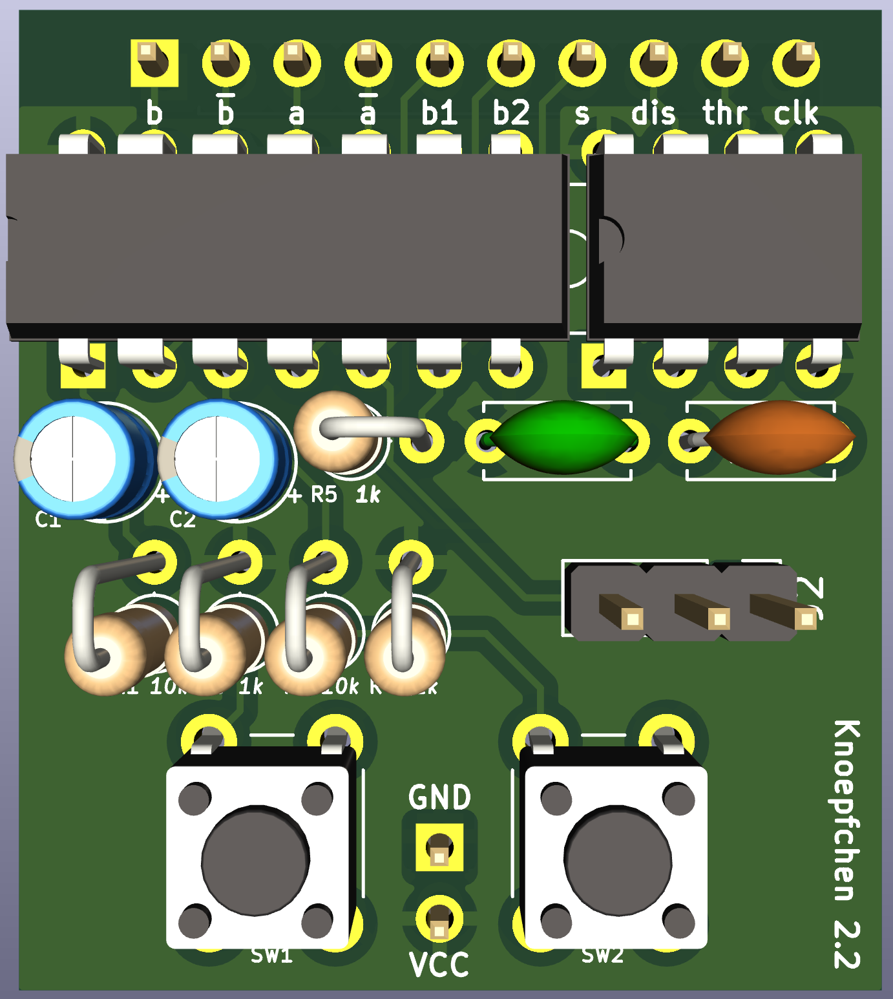

# Knoepfchen

The unpronounceable PCB!

## Purpose

A small PCB with two debounced buttons, a debounced [SPDT](https://en.wikipedia.org/wiki/Switch#Contact_terminology) switch, and a [555](https://en.wikipedia.org/wiki/555_timer_IC) in astable configuration.

When experimenting with logic circuits, one often needs a switch or a button or a clock.
However, putting small debounce circuits on the breadboard over and over again is tedious.
Knoepfchen is a small PCB that you can just put on your breadboard and get two debounced buttons, a debounced switch, a 555 in astable mode, a two inverters with all relevant connectors available.

## Connectors

Knoepfchen has to rows of connectors:
The lower ones connect to the power rails of the breadboard.
The upper row can be plugged into the upper half of the breadboard and exposes all relevant connectors. These are from left to right:

| Number | Label | I/O | Description                                       |
| ------ | ----- | --- | ------------------------------------------------- |
| 1      | a     | I   | Input to an 74HCT14 inverter                      |
| 2      | ~a    | O   | Negation of a (output of inverter)                |
| 3      | b     | I   | Input to an 74HCT14 inverter                      |
| 4      | ~b    | O   | Negation of b (output of inverter)                |
| 5      | b1    | O   | Debounced button 1 (active high)                  |
| 6      | b2    | O   | Debounced button 2 (active high)                  |
| 7      | s     | O   | Position 1 of debounced SPDT switch               |
| 8      | DIS   | -   | Pin 7 of 555                                      |
| 9      | THR   | -   | Pin 6 of 555                                      |
| 10     | CLK   | O   | Pin 3 of 555                                      |

## Components

In addition to a few standard resistors and capacitors (see schematics) you need two standard tactile buttons as commonly shipped in electronics starter packages. The only thing special to Knoepfchen is the [APEM 25000N](https://www.reichelt.de/schiebeschalter-gerade-rm2-54-1x-ein-ein-ss-25136-nh-p105709.html?&trstct=pos_2&nbc=1) SPDT switch. Maybe you can solder another switch onto Knoepfen, but the PCB is laid out for that switch's geometry.

## Usage

- The buttons can be used for reset or a manual clock pulse.
- The RC network of the buttons also can also serve as a power-on reset circuit, providing a active-high RESET signal after ~40ms (see details below).
- The two inverter inputs can for example be used to create a active-low RESET signal and/or an inverted clock.
- If you don't need the 555, just leave pins 9-11 unconnected.
- If you don't need an inverter input, tie it low or high.
- All other pins don't need to be connected.

## Technical Details

- The switch debouncing circuit uses two inverter gates in a feedback configuration through a resistor (R5) as in The Art of Electronics, 3rd ed. Figure 10.52, page 730.
- The two buttons are identical and debounced using a standard RC circuit as in [this document](https://www.we-online.com/web/en/index.php/download/media/07_electronic_components/download_center_1/application_notes_berichte/sn015__contact_circuit_debounce_for_switches/SN015a_EN.pdf) but without the diode. Resistors R1 and R2 from the schematics are 1k and correspond to R1 in the document. Similarly, R3 and R4 are 10k and correspond to R2 in the document. C1 and C2 correspond to the capacitor and have 1µF each.
- C5 is a decoupling capacitor for the '14 chip and the 555.
- C4 connects to the CONTROL pin (pin 5) of the 555 and to GND.

## Configurations for the 555 in Astable Mode

Here, a brief summary of two standard configurations to get a clock signal out of the 555.

1. The standard configuration
    - Resistor R1 from Vcc to DIS
    - Resistor R2 from DIS to THR
    - Capacitor C from THR to GND
    - Frequency: $\frac 1{\ln 2\cdot(R_1+2R_2)\cdot C}$
    - Duty cycle: $\frac {R_1+R_2}{R_1+2R_2}$ 
2. A 50% duty cycle configuration
    - Resistor R from THR to CLK
    - Capacitor C from THR to GND
    - DIS not connected
    - Frequency: $\frac 1{2\ln 2\cdot RC}$ 
    - Duty cycle: 50%
    - Note that you cannot put a resistive load to CLK without changing the duty cycle. 

More details on both configurations and more can be found for example [here](https://www.electronics-tutorials.ws/waveforms/555-circuits-part-1.html).
